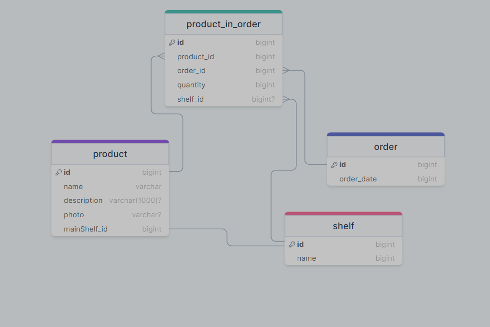

# Тестовое задание
  Ответ сервиса при orders = 10,11,14,15
  ```json
  [
  {
    "product_id": 1,
    "product_name": "Ноутбук",
    "shelf_id": "1",
    "shelf_name": "А",
    "quantity": 2,
    "order_id": 10
  },
  {
    "product_id": 2,
    "product_name": "Телевизор",
    "shelf_id": "1",
    "shelf_name": "А",
    "quantity": 3,
    "order_id": 11
  },
  {
    "product_id": 1,
    "product_name": "Ноутбук",
    "shelf_id": "1",
    "shelf_name": "А",
    "quantity": 3,
    "order_id": 14
  },
  {
    "product_id": 3,
    "product_name": "Телефон",
    "shelf_id": "2",
    "shelf_name": "Б",
    "quantity": 1,
    "order_id": 10
  },
  {
    "product_id": 6,
    "product_name": "Микрофон",
    "shelf_id": "6",
    "shelf_name": "Ж",
    "quantity": 1,
    "order_id": 10
  },
  {
    "product_id": 4,
    "product_name": "Системный блок",
    "shelf_id": "6",
    "shelf_name": "Ж",
    "quantity": 4,
    "order_id": 14
  },
  {
    "product_id": 5,
    "product_name": "Часы",
    "shelf_id": "6",
    "shelf_name": "Ж",
    "quantity": 1,
    "order_id": 15
  }
]
```
Схема таблиц
